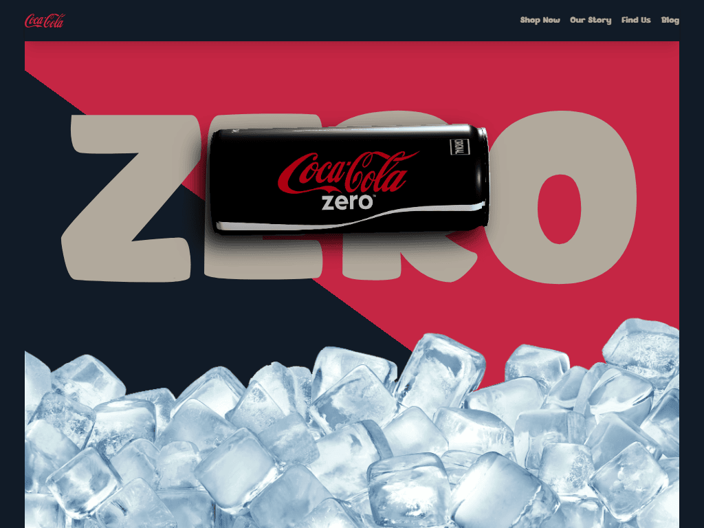
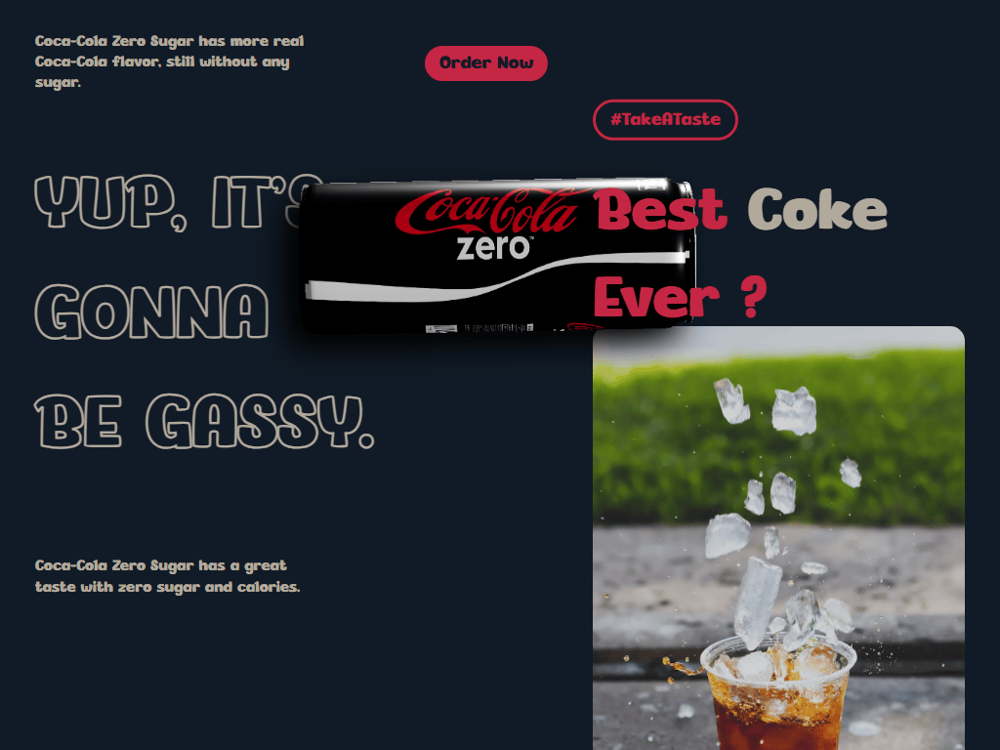
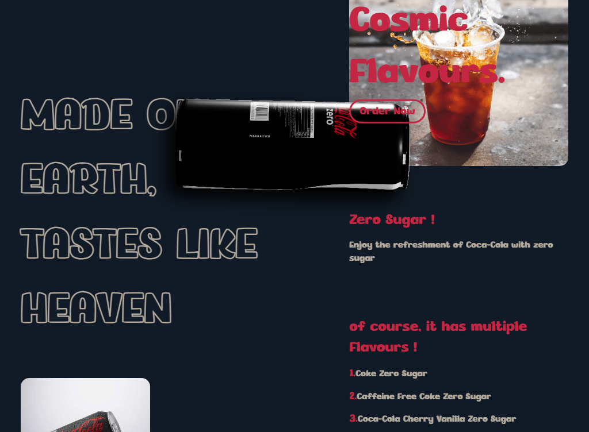
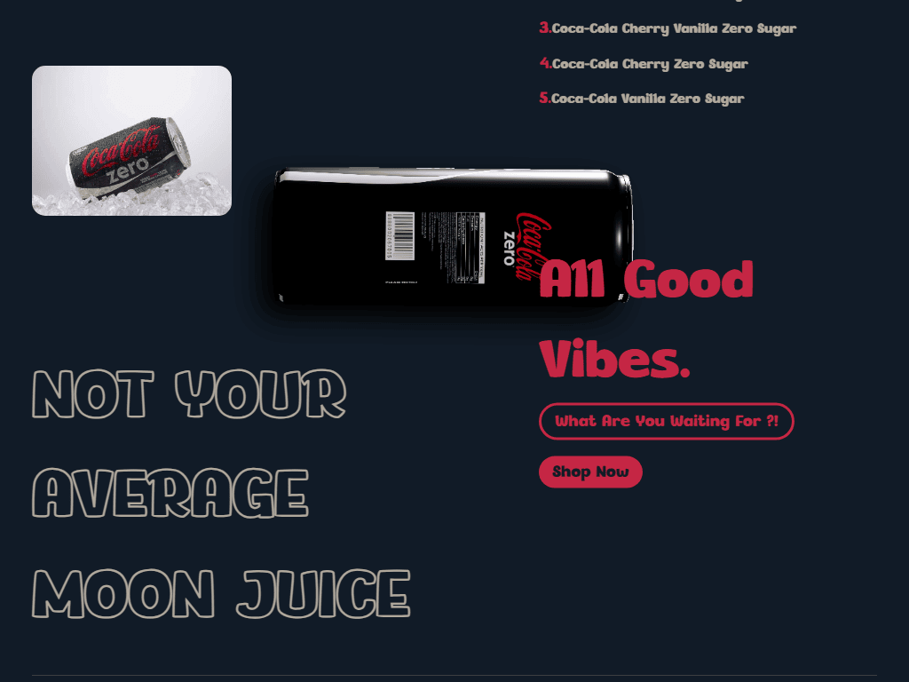
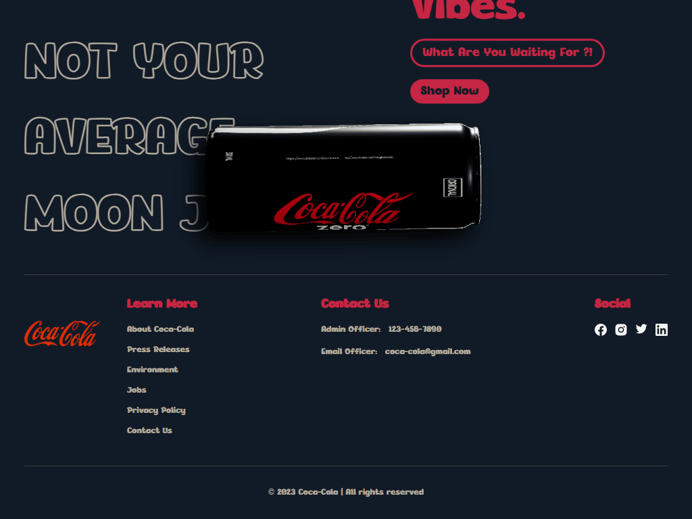
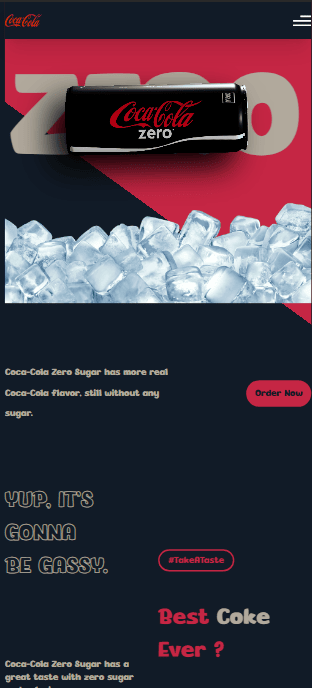

# 🥤 Coca-Cola Zero

### A modern UI/UX website that showcases a 3D model and the Power of Design.

## Link 🔗 [https://charactermi.github.io/coca-cola_zero](https://charactermi.github.io/coca-cola_zero)

 

# Preview

 

# Mobile Responsive

# Technologies

 

<ul>
    <li>
        
    </li>
    <li>
        
    </li>
    <li>
        
    </li>
    <li>
        
    </li>
    <li>
        
    </li>
    <li>
        
    </li>
</ul>